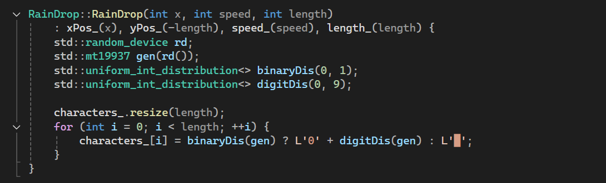
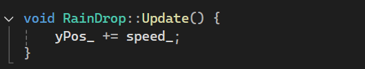
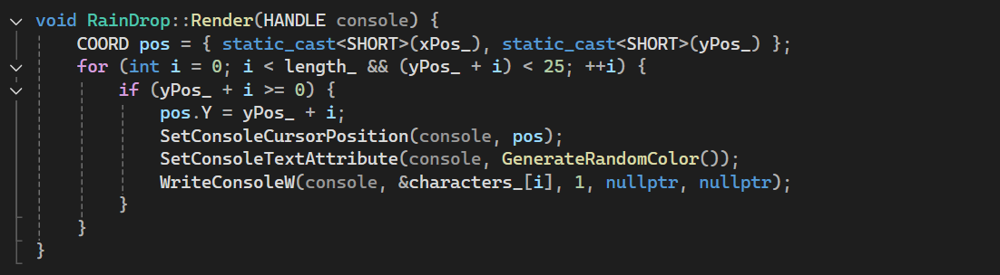
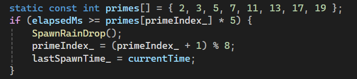

# Algorithm

## Overview  

The **Digital Rain** algorithm is designed to simulate falling symbols in a cascading effect while synchronizing with the **Super Mario Bros. theme song**. It achieves this using **multi-threading**, **randomized raindrop generation**, and **frame-based animation**. The algorithm ensures that the rain effect appears smooth, dynamic, and responsive to the music playing in the background.

Digital Rain algorithm is intended to simulate cascading falling symbols and synchronize itself with the music of **Super Mario Bros**. It achieves this with **multi-threading**, **random creation of raindrops**, and **animation based on the frame**. The algorithm creates a smooth, dynamic, and background music-responsive look for the rain effect.

**Algorithm 1: Random Character Generation**

My RainDrop's constructor utilises a random character generation algorithm to produce an individual stream of random characters for each raindrop, made up of a combination of digits (0-9) and blocks (█) for a Matrix-like digital rain illusion. The random number algorithm utilizes the state-of-the-art Mersenne Twister generator to produce high-quality random numbers in the method, generating rich random pattern streams in a semi-random and continuous fashion. Here is a code snippet that highlights the main aspects discussed and I will review this in further detail below

- : xPos_(x), yPos_(-length), speed_(speed), length_(length): This sets the raindrop's initial position, speed, and length by initializing member variables via an initializer list.std::random_device rd;: This line is seeding the random generator with a non-deterministic value that is provided by hardware.

- std::mt19937 gen(rd());: This creates the Mersenne Twister engine, seeded by rd, for usage when selecting random values.std::uniform_int_distribution<> binaryDis(0, 1);: This creates a binary distribution for a value of either 0 or 1 to use for selecting between digits or blocks.

- std::uniform_int_distribution<> digitDis(0, 9);: This creates a distribution for a digit between 0-9.characters_.resize(length);: This allocates space for the characters_ vector for length wide characters.

- for (int i = 0; i < length;   i): This creates a loop for all the available positions in the raindrop.characters_[i] = binaryDis(gen) ? L'0'   digitDis(gen) : L'█';: This is a ternary operator: if I get a 1 from binaryDis(gen) it will add the random digit (L'0'   digitDis(gen) would convert the number 0-9 to '0'-'9'), if not selected it would use the block character L'█'.

**Algorithm 2: Raindrop Movement**

In RainDrop::Update(), the raindrop action is calculated by gradually updating the raindrop's y position, using the raindrop's speed. This is a basic linear update that allows for consistent animation over frames.

yPos_  = speed_;: The raindrop’s y-position is increased by its speed_ (given a random value between 1-3 in SpawnRainDrop()). This translates the raindrop each frame downwards.

**Algorithm 3: Console Rendering**

In the RainDrop::Render() console rendering algorithm, each raindrop is drawn at a given location on the screen, with random colors applied, while also ensuring that the drawn characters stay within bounds. The implementation relies on Windows console functions to allow for accurate positioning and styling. The following relevant code with explanations.

COORD pos = { static_cast<SHORT>(xPos_), static_cast<SHORT>(yPos_) };
The program creates a COORD structure called pos that contains converted SHORT values for raindrop starting x and y coordinates.

A loop increment starts at i = 0 yet it terminates when length_ becomes zero or when yPos_ + i reaches 25.
The function advances through all raindrop characters until its length is reached or it reaches the console's row 25 boundary.

- if (yPos_ + i >= 0)
The program checks for visible characters in the screen by passing through all positions having y-values greater than zero.

- pos.Y = yPos_ + i;
The current character drawing position gets its y-coordinate changed during this moment.

- SetConsoleCursorPosition(console, pos);
Sets the console cursor position at the location where the character needs to be displayed.

- SetConsoleTextAttribute(console, GenerateRandomColor());
The function sets a random text color from 1 to 15 which it obtains from GenerateRandomColor().

- WriteConsoleW(console, &characters_[i], 1, nullptr, nullptr);
Outputs a single wide character to the console at the set position.

**Algorithm 4: Raindrop Spawning with Prime Intervals**

The DigitalRain::Update() function controls raindrop spawning through a prime number sequence to generate irregular yet patterned appearance timing. Spawning intervals exist in equilibrium with the distribution of visual elements.

static const int primes[] = { 2, 3, 5, 7, 11, 13, 17, 19 };: Establishes an array consisting of prime numbers for timing duration calculations, the check verifies if elapsedMs exceeds the current prime number value multiplied by 5 milliseconds.
The program executes SpawnRainDrop() to generate a new raindrop with random characteristics, primeIndex_ = (primeIndex_ + 1) % 8;: Cycles to the next prime, wrapping around after 19 and the lastSpawnTime_ = currentTime then resets the spawn timer.
