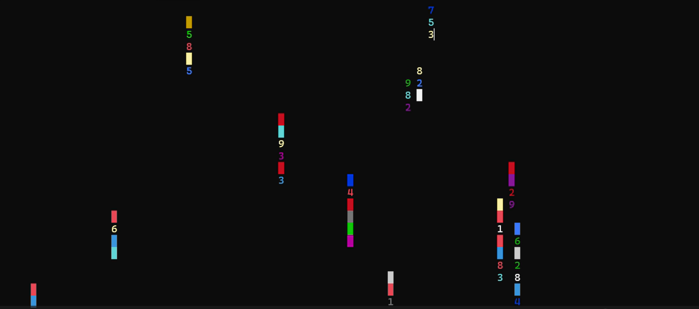
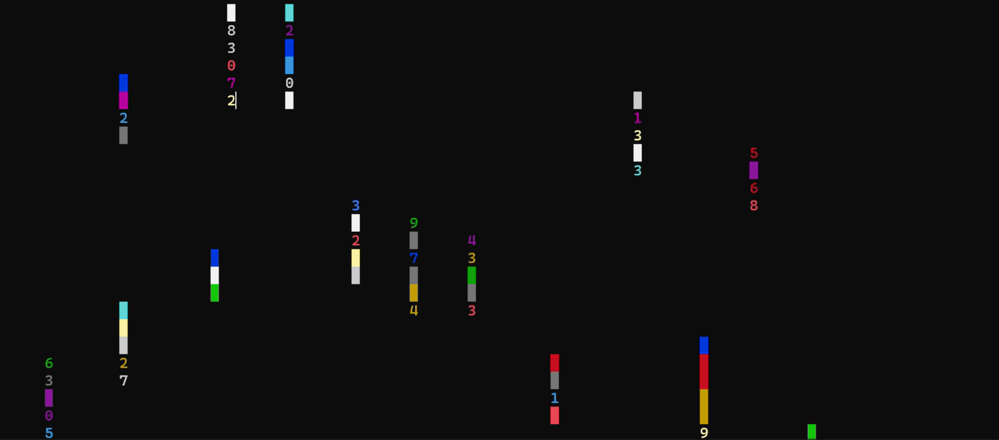
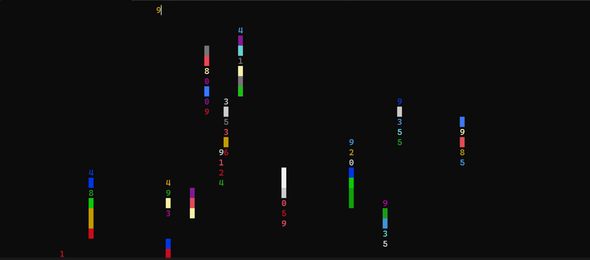

# Table of Contents

- [Introduction](introduction.md)
- [Design & Test](design-test.md)
- [Algorithm](algorithm.md)
- [Problem-solving](problem-solving.md)
- [Modern C++ Insight & Reflection](modern-cpp.md)

# Welcome to the Project Blog

My Digital Rain program is a C++ program that emulates the Matrix code rain animation on the console. It utilises two classes: RainDrop for every stream of falling characters and DigitalRain to manage the overall animation. The program adds a twist by using beeps to play the Super Mario Bros. theme song. It runs so smoothly, updating the screen some 30 times per second, and displaying beautifully colored characters descending with background music. The project marries coding skill with an incredible visual and audio experience.

## About Project

Digital Rain is a C++ console program that simulates the famous "Matrix" code rain effect. It features:

- RainDrop & DigitalRain Classes – Manage cascading characters dynamically.
- Smooth Animation – Refreshes the screen 30 times per second.
- Vivid Visuals – Brightly colored characters descend in a mesmerizing pattern.

 Click on the different sections for more details!

## Project Images:

<video width="320" height="240" controls loop muted autoplay>
    <source src="docs/assets/images/Rain drops.mp4" type="video/mp4">
  
</video>

## References

[1] Microsoft, "Windows Console API," [Online]. Available: https://docs.microsoft.com/en-us/windows/console/. [Accessed: Mar. 2, 2025].

[2] C++ Reference, "std::chrono - C++ Standard Library," [Online]. Available: https://en.cppreference.com/w/cpp/chrono. [Accessed: Mar. 5, 2025].

[3] C++ Reference, "std::random_device and std::mt19937," [Online]. Available: https://en.cppreference.com/w/cpp/numeric/random. [Accessed: Mar. 12, 2025].

[4] Microsoft, "SetConsoleCursorPosition function (consoleapi.h)," [Online]. Available: https://learn.microsoft.com/en-us/windows/console/setconsolecursorposition. [Accessed: Mar. 15, 2025].

[5] C++ Reference, "std::chrono::steady_clock - C++ Standard Library," [Online]. Available: https://en.cppreference.com/w/cpp/chrono/steady_clock. [Accessed: Mar. 16, 2025].

[6] A. Nash, "Generating random numbers using Mersenne Twister," LearnCpp, [Online]. Available: https://www.learncpp.com/cpp-tutorial/generating-random-numbers-using-mersenne-twister/. [Accessed: Mar. 16, 2025].
