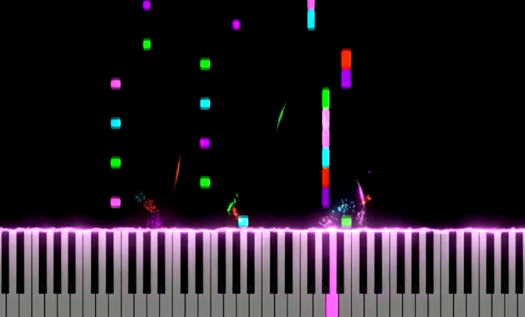
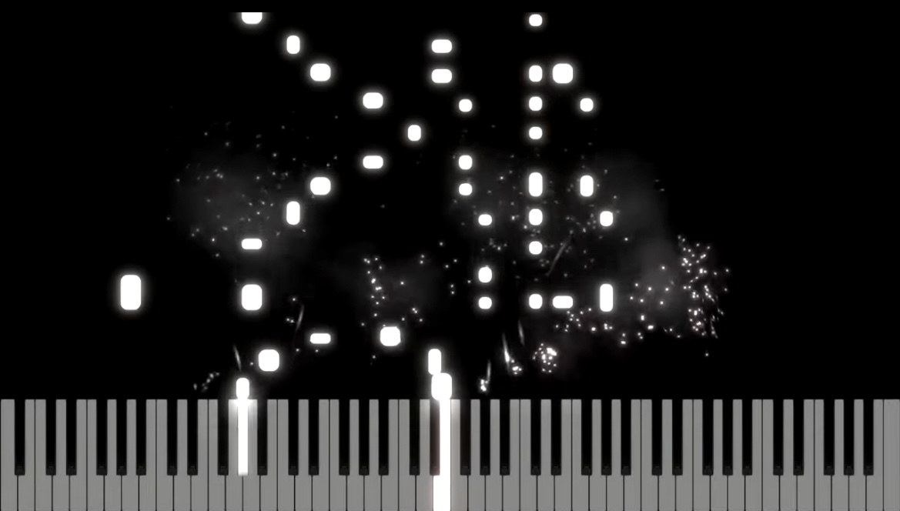
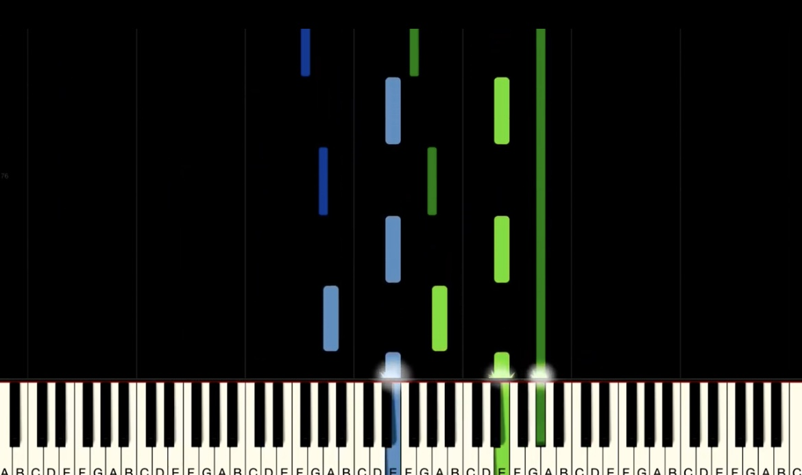

# Introduction

The inspiration for this project is the rhythm games like Piano Tiles and falling keys piano tutorial playthroughs, in which keys or notes fall in a sequential manner. The games provide an entertaining way of learning musical timing and coordination, as well as a visually engaging experience.

For my project, the same appearance is used but with Digital Rain effect, inspired by the Matrix Rain visualization. Through a blend of procedural randomness and cascading symbols, it is tried to achieve a dense console-like graphical presentation. Additionally, in regards to interactivity, background play of the background music—a special case of this being the Super Mario Theme—is added. This is a funny and retro feature.

There is something unique to the project in that the rhythm of the falling raindrops synchronizes with the Super Mario WAV file. While making the raindrops fall, they are made to appear like playing musical notes on a pretend keyboard in synchrony with the rhythm of the music. This creates an illusion to the effect that the pouring symbols are perceived as similar to the musical notes themselves, reasserting the correlation between vision movement and music.

This application is based on C++ and Windows Console API and employs multi-threading to output animation and audio playback in parallel. The falling animated characters are created dynamically over alternating patterns that change at prime time intervals, thereby producing another timing difference in the look.
Over the course of the rest of the discussion in this paper, I will discuss the following aspects of the project:

Design & Test: High-level system design, interaction between components and with themselves, and how it is tested.
Algorithm: Explanation of logic utilized to create rain, motion, and randomness.
Problem-Solving: Problems found during implementation and how they were solved. = Modern C++ Insight & Reflection: Key C++ features utilized and where the author could have improved.
This project is a demonstration of console graphics and procedural animation as well as an entry point to other interactive software or music visualizations.

