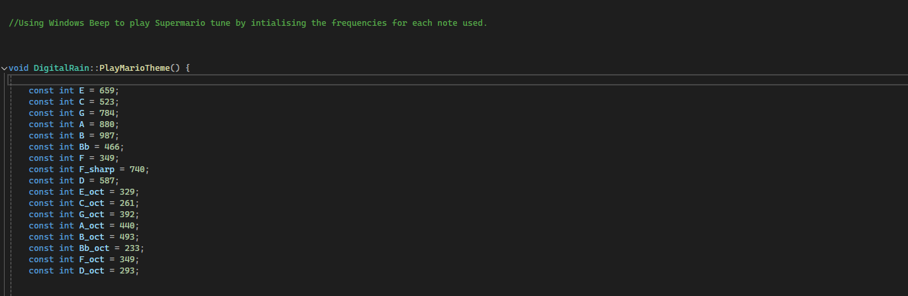

## Problem Solving

While working on my project I faced various obstacles while generating Digital Rain which needed problem-solving and thorough debugging to develop a precise simulation that captivates users. I will describe major development challenges while providing solutions I used to solve these issues so my project reached its visual and auditory targets.

## Raindrop Spawning & Movement
My objective during development was to make raindrops appear randomly while sliding effortlessly toward the ground, though I faced problems where they either disappeared prematurely or failed to display correctly. The main problem originated from forced random drop spawning because it made rainfall cluster incorrectly and disappear during movement which was why it was breaking the expected smooth Matrix inspired effect.

The original issue stemmed from using simple Sleep(100) time delays which resulted in both too frequent or too infrequent raindrop spawning leading to disordered visual effects. The update process felt flawed because using yPos_ += 1 initially led to movement problems when the rendering rate differed from the drop speeds causing the effect to break.

### Solution: 
DigitalRain::Update() received prime numbers through a static constant array primes[] = { 2, 3, 5, 7, 11, 13, 17, 19 } to develop a prime-index-based spawning mechanism. The code implemented if (elapsedMs >= primes[primeIndex_] * 5) { SpawnRainDrop() primeIndex_ = (primeIndex_ + 1) % 8 }. Natural randomness was added through the system which generated different time intervals (10ms, 15ms and so on) during updates. The RainDrop object now updates yPos_ by speed_ while Run() maintains a frame rate of 33ms. Therefore updates happen at a rate of 1-3 in the SpawnRainDrop method. The modification of code produced visible and continuous movement for raindrops throughout the display screen.

## Background Music Playback Issues
My initial try with beep.h to play Super Mario music failed badly resulting in a jumbled disordered melody that competed negatively with the visual element of the rain drops. The audio track failed to perform as expected which diminished the intended experiance I had planned.

The first attempt involved including <beep.h> while writing Beep(261, 200) Beep(293, 200) to produce the Mario theme notes (C4, D4, ...). The frequencies generated through my program experienced playback glitches at specific values (e.g. 523 Hz for C5) because of potential memory issues and inaccurate rounding. Furthermore, the Beep blocking nature disrupted the timing during playback resulting in incorrect sequences of notes with harsh bursts damaging the selected song and presented a issue for me.

### Solution: 
I resolved the beep.h challenge by implementing the Windows API’s PlaySound function within PlayMarioTheme() using the following parameters: BOOL success = PlaySound(TEXT("C:\\Users\\G00401971@atu.ie\\Downloads\\SuperMario.wav"), NULL, SND_FILENAME | SND_ASYNC | SND_LOOP). I firstly used Audacity to convert my Super Mario mp3 to a WAV file, I then used SND_LOOP together with SND_ASYNC to play my WAV file asynchronously and keep the loop ongoing while avoiding manual note programming. Through this approach the project generated a clear unbroken soundtrack which perfectly synchronized with the rain effects to enhance the project significantly.

## Raindrop Deletion & Performance Improvement

While working on my project performance began to decrease during the simulation when I increased raindrop counts and the screen displayed flickering together with slow loading times especially at heavy workload conditions. The issue intensified because I was not clearing screen-dropped raindrops effectively which therefore caused waste of memory along with processing power.

In the beginning I did not implement drop removal resulting in drop_.size() growth from SpawnRainDrop(). During rendering of drops outside the display area (yPos_ > height_) the system ran slowly because system("cls") failed to maintain screen refresh. The console drew everything from scratch at once which resulted in more leniency in the slowdown.

### Solution: 
For DigitalRain::Update() it received a new drops_.erase operation I created to clean off-screen raindrops by using std_.remove_if(). The Lambda function with IsOffScreen(height_) determined which drops to remove before drops_.end(). The lambda function with std::remove_if function detected drops that IsOffScreen(height_) marked for elimination (yPos_ >= height_) before the drops_.erase operation removed them. such memory-management updates and rendering operations became more efficient through streamlined operations before each update which stabilized performance while also removing flicker effects despite abundant raindrops.

## Console Window Size & Resolution
The default console window dimensions restricted the display of raindrops so that they were either hidden or shown in cramped fashion thereby affecting the intended effect. The simulation would either fall short by stopping in the middle or display an overflow because of the fixed dimensions.

From the beginning my application operated under console defaults of 80x25 while expanding dimensions in DigitalRain::DigitalRain(int width, int height) resulted in trucation of all raindrops which touched either 79 for xPos_ or 25 for yPos_ + length_. Text wrapping together with the disappearance of words would make the Matrix appear compressed and unprofessional until users resized the display area.

### Solution:
The resolution to this problem appeared during InitializeConsole() implementation through two API functions: SetConsoleScreenBufferSize(hConsole_, { static_cast<SHORT>(width_), static_cast<SHORT>(height_) }) which sets the buffer size and SetConsoleWindowInfo(hConsole_, TRUE, &windowSize) which configures the window size to { 0, 0, static_cast<SHORT>(width_ - 1), static_cast<SHORT>(height_ - 1) }. The program expanded the buffer's window dimensions to my desired width_ and height_ dimensions so all raindrops could appear without distortion and the simulation could demonstrate its full potential.

## Synchronization Between Raindrops & Music

I set out to align raindrops with the Mario theme for a unified effect, but at first, the drops fell randomly, out of step with the music’s rhythm, disrupting the audio-visual harmony I aimed for.

Detailed Problem: Before tweaking spawning, I used a flat timer like: if (elapsedMs > 100) { SpawnRainDrop() }, spawning drops at steady intervals unrelated to the music’s 120 BPM beat. This made the simulation feel random and detached—raindrops didn’t match the melody’s lively pulse, missing the “rain as notes” synergy I envisioned.

### Solution: 
I fixed this by linking spawning to prime intervals in Update(): if (elapsedMs >= primes[primeIndex_] * 5) { SpawnRainDrop() primeIndex_ = (primeIndex_ + 1) % 8 }. The primes (2, 3, 5, etc.) gave a varied yet rhythmic spawn pattern (e.g., 10ms, 15ms), tuned to roughly echo the music’s tempo and to also give a visual affect that the rain drop is a piano note falling down to represent which note is being played on the WAV file. This made raindrops seem to “dance” with the tune, creating a subtle, note-like rhythm that tied the visuals and audio together beautifully.

